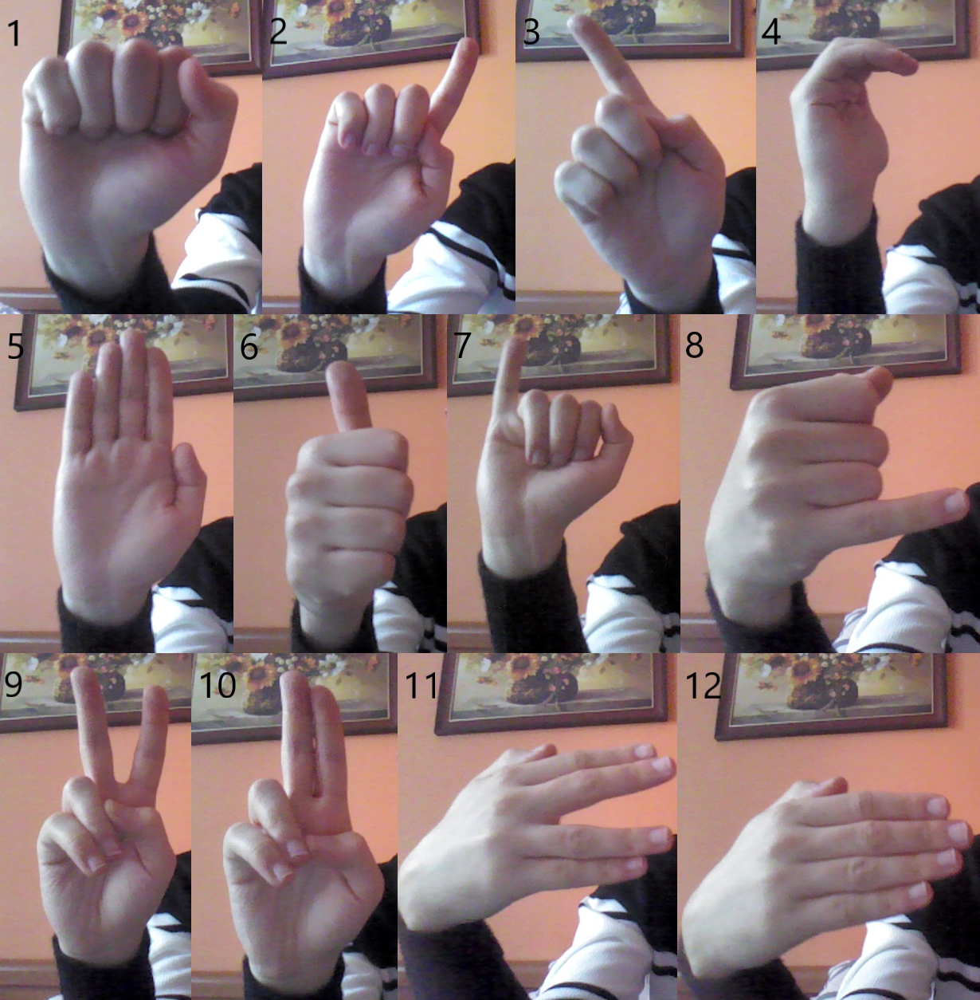

<!--
*** Thanks for checking out this README Template. If you have a suggestion that would
*** make this better, please fork the repo and create a pull request or simply open
*** an issue with the tag "enhancement".
*** Thanks again! Now go create something AMAZING! :D
-->

# Using deep neural networks to recognize hand gestures to control a mobile robot using a camera.
The purpose of this project was to build a system that allows user to control the Arlo mobile robot using static hand gestures, with use of camera. The project consists of three parts, the first was to develop script that supposed to recognize the gestures controlling the robot. For this purpose author used convolutional neural network, which had to be properly trained. The next step was to create a robot program that had to properly react to application commands. The last step was to handle communication between programs, Bluetooth 4.0 Low Energy standard was used for this purpose. Unfortunately, during the final control test Bluetooth module has been damaged, in this case the author decided to use simple serial communication instead. The main assumptions of the project were to achieve real-time processing system and achieve high accuracy of hand gesture recognition.  
Arlo: https://www.parallax.com/product/arlo-robotic-platform-system  

Full video: https://www.youtube.com/watch?v=j6qOpACT1z0  
### Built With
* [Pytorch](https://pytorch.org/)
* [PyQt](https://python101.readthedocs.io/pl/latest/pyqt/)
* [Parallax](https://www.parallax.com/product/28966)
* [Bleak](https://github.com/hbldh/bleak)
* [PySerial](https://github.com/pyserial/pyserial)
* [OpenCv](https://pypi.org/project/opencv-python/)

### Installation

1. Clone the repo
2. Install python 3
3. Install python dependencies, such as: Pytorch, Bleak, PyQt
4. Run script "mainAplication.py"

<!-- USAGE EXAMPLES -->
## Description
### mobile robot Arlo

### Gui interface:  
  
1. Manual command list,
2. Send manual chosen command, 
3. Command window, contains information about, gestures captured, execution command status etc.,
4. Frames per second,
5. On/Off neural network processing,
6. On/Off automatic gesture detection. If gesture is detected for more than 2s script automatically sends command to Arlo. Can be also activated via Ctrl.
7. Connect/Disconnect,
8. Emergency stop, cancels all commands actual beeing in execution. Can be also activated via Shift 
9. Commands and probability of ocurance in actual dataframe
10. Dataframe preview in 640x480 resolution, grey area is ignored in gesture detection process.    

  
### Controlling commands:  
1. Default
2. Turn left  
3. Turn right 
4. Turn around 
5. Forward
6. Backward   
### Setting commands:  
7. Speed up  
8. Slow down 
9. Bigger turn angle
10. Smaller turn angle 
11. Bigger step 
12. Smaller step 
13. Emergency Stop

## License

Distributed under the MIT License. See `LICENSE` for more information.

## Author

Sylwester Dawida  
Poland, AGH  
2020

